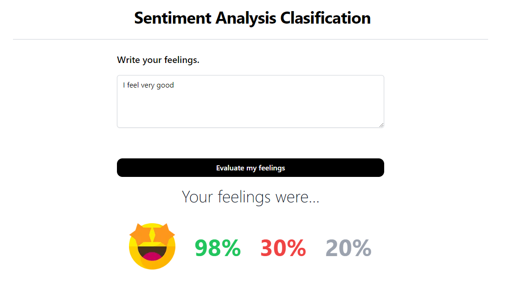

# Text Sentiment Analysis Clasification

Se implementa un modelo de entrenamiento de lenguaje natural para la clasificación de analisis de sentimientos. Este modelo será capaz de procesar y comprender el texto en diferentes contextos y clasificarlo en categorías como positivo, negativo o neutral.

## Captura de pantalla


## Getting Started

First, run the development server:

```bash
npm run dev
# or
yarn dev
# or
pnpm dev
```

Open [http://localhost:3000](http://localhost:3000) with your browser to see the result.


